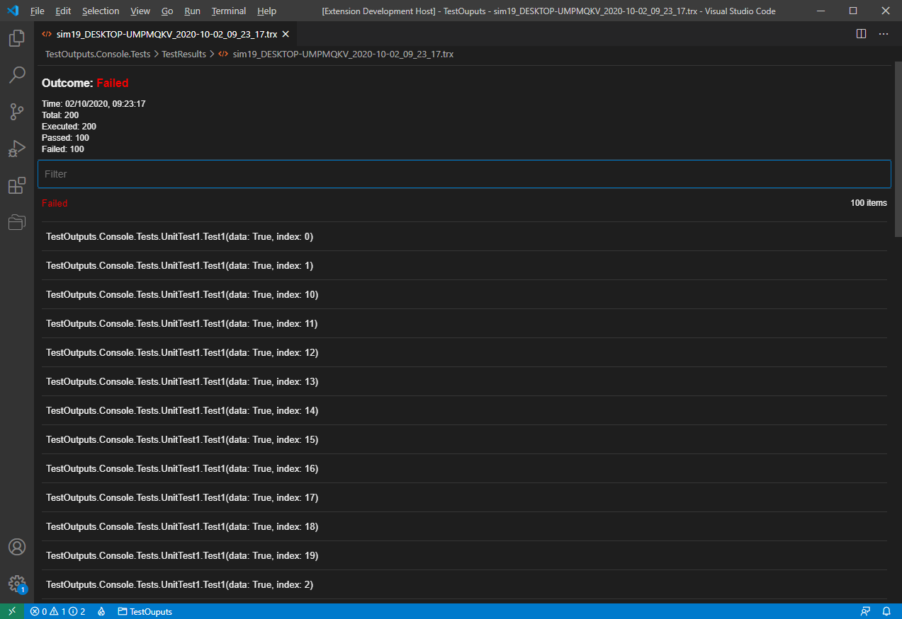

# vscode-trxviewer

Welcome to the home of the Txr viewer extension.

## Features

- Can filter tests by name
- Tests are grouped by outcome
- Failures are first and expanded by default
- Possible to navigate to test method 
- Partial theme support

## How to debug
As I haven't found a way to start debugging after two background watch tasks are ok:

1. Open root repo folder with vs-code
2. ctrl-shift-p "Tasks: Run Task"
3. Select "watch"
4. Press f5

To debug updated code: 
1. close debugged vs code
2. make sure there are no "watch" build errors 
3. press f5

To debug the frontend of the extension: 
1. If in store downloaded extension: go set vscode setting: `"trxviewer.enableSourceMaps": true`
    
   Else: Do previous steps
3. ctrl-shift-p "Developer: Open Webview Developer Tools"
4. Go to sources
5. Select active-frame
6. Find `webpack://`
7. Enjoy your breakpoints

## Local build
If you just want to build the extension and install it locally from source: 
1. Clone the repo!
2. Open your shell of choice
3. Run: `docker build -t trxviewer:local . && docker run --mount type=bind,source=/d/temp,target=/extract trxviewer:local` 
    
   But replace `/d/temp` when the folder of your choice
4. code --install-extension d:\temp\trxviewer-0.0.5.vsix
    
   But replace `d:\temp` with the same folder of your choice, you may also need to find the right vsix filename if the version is wrong.

## Contributing 
Altough no contributing guide is available yet, if you wish to help, please open a bug to discuss changes then open a PR with agreed solution!
